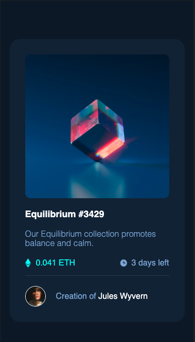
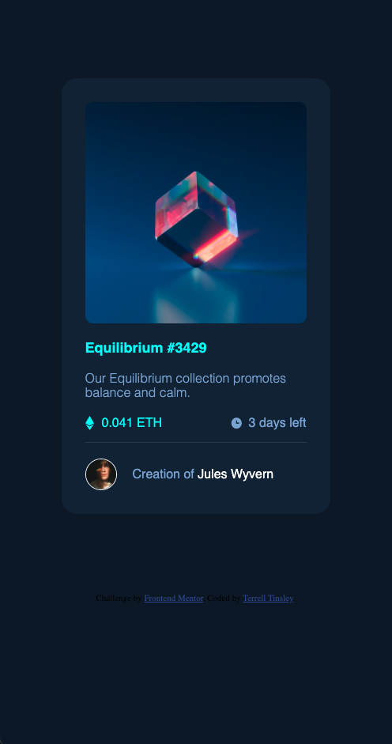

## Table of contents

- [Overview](#overview)
  - [Screenshot](#screenshot)
- [My process](#my-process)
  - [Built with](#built-with)
  - [What I learned](#what-i-learned)
- [Author](#author)

## Overview

### Screenshot


-  -> Mobile View
-  -> Desktop View
-  -> When the mouse hovers over NFT image
-  -> When the mouse hovers over the Header
-  -> When the mouse hovers over the author

## My process

### Built with

- Semantic HTML5 markup
- CSS custom properties
- Flexbox
- CSS Grid
- Mobile-first workflow

### What I learned

The key thing that I learned was a simpler way of setting a background image. The previous way that I've tried took a lot of time and extra code. The way below made it 10times faster and easier. 
``` CSS
 .on-hover{
      background-color: hsl(178, 100%, 50%);
      border-radius: 10px;
      height: 280px;
      margin-bottom: 20px;
      background-image: url('images/icon-view.svg');
      background-repeat: no-repeat;
      background-position: center;
    }
```
Another thing that I learned that I forgot how to do. Was how to sperate a <p> so that you can style part of it. This allowed me to be able to have the 'Creation of' one color and the 'Jules Wyvern' another color. 
``` HTML
<p>Creation of <span> Jules Wyvern</span></p>
```
``` CSS
#nft-creator p{
      align-self: center;
      color: hsl(215, 51%, 70%);
    }
    #nft-creator span{
      color: hsl(0, 0%, 100%);
    }
```

## Author

- Website - [Terrell Tinsley](https://www.ttinsley.dev)
- Frontend Mentor - [@TRellTins](https://www.frontendmentor.io/profile/TRellTins)
- Twitter - [@TRellTinsley](https://www.twitter.com/trelltinsley)
